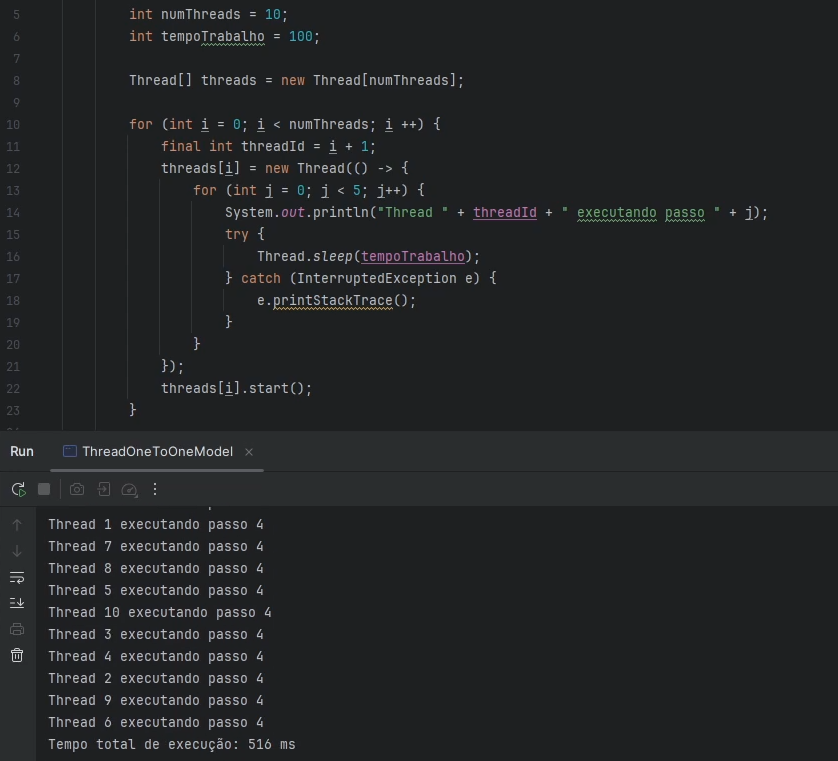
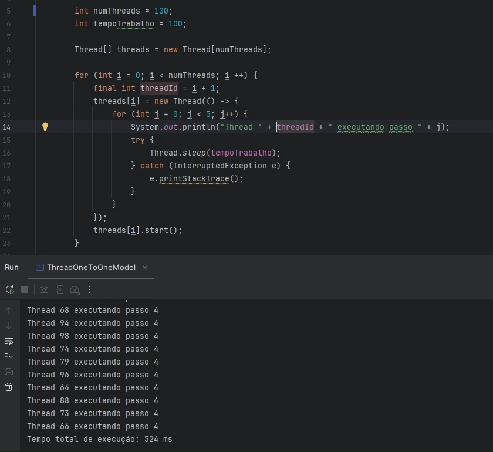
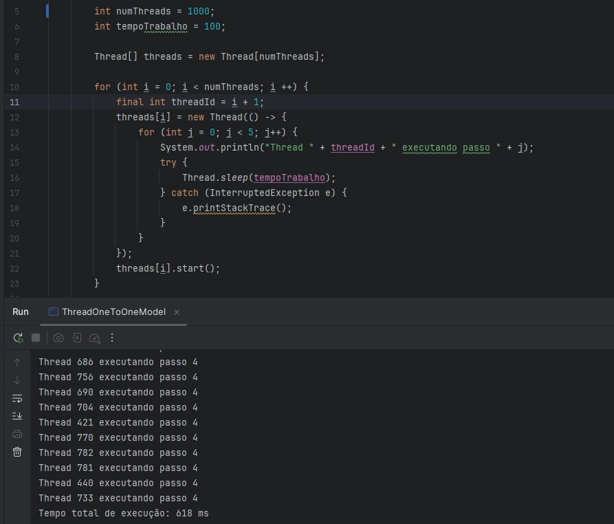
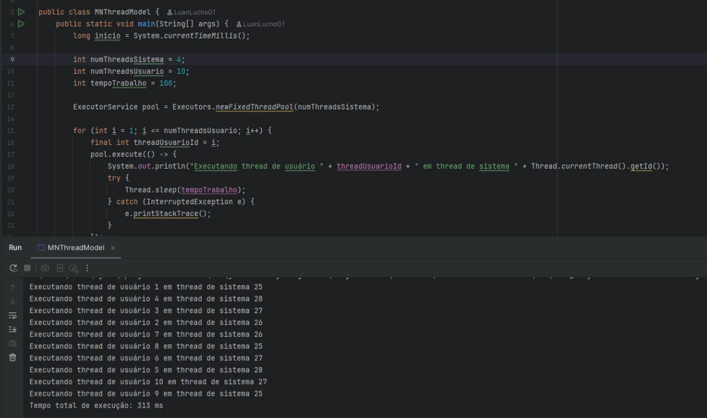
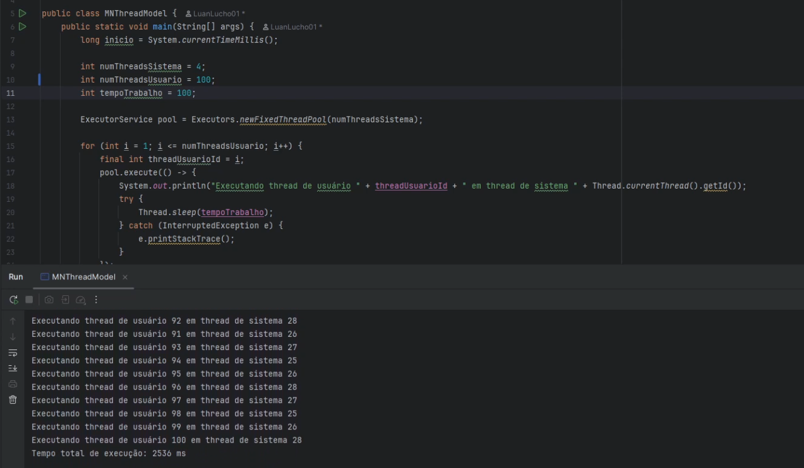
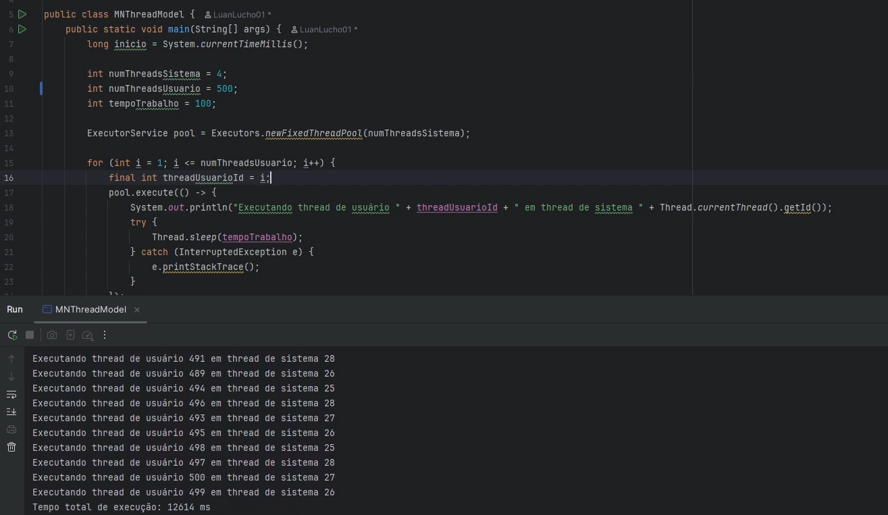
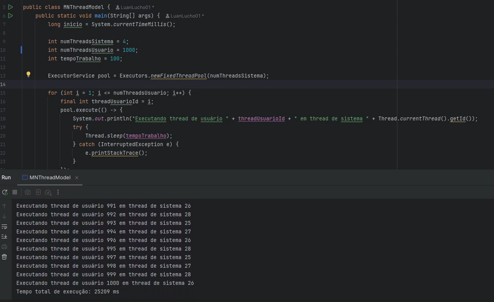
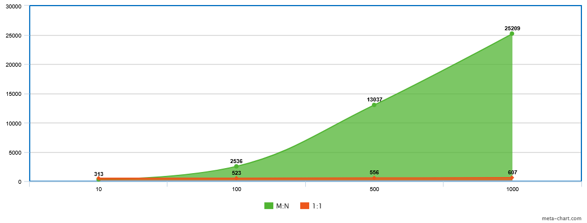

<h2 align="center">Modelo 1:1</h2>

1:1 - 10 Threads: 516ms

1:1 - 100 Threads: 524ms

1:1 - 500 Threads: 582ms

1:1 - 1000 Threads: 618ms

---

<h2 align="center">Modelo N:M (4 threads reais)</h2>

M:N - 10 Threads: 313ms

M:N - 100 Threads: 2536ms

M:N - 500 Threads: 12614ms

M:N - 1000 Threads: 25209ms

---

<h2 align="center">Gráfico Comparativo</h2>

---

O modelo **N:M** apresentou vantagem apenas com poucas threads (até cerca de 10), pois o custo de troca entre threads ainda é baixo e há aproveitamento do paralelismo.  
Conforme o número de threads de usuário cresce, o modelo **1:1** torna-se mais eficiente, já que evita a sobrecarga de multiplexação e aproveita melhor os núcleos disponíveis do sistema operacional.
